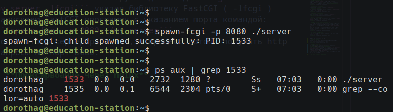
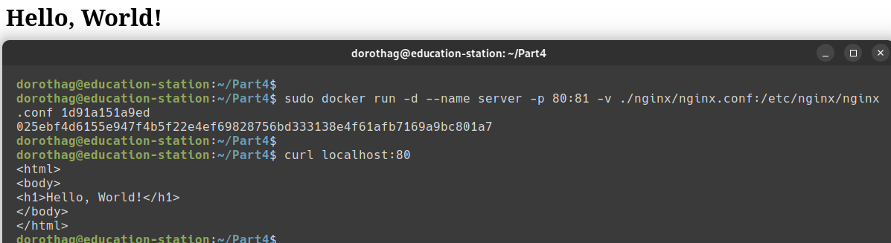

## Part 1. Готовый докер ##

* **Официальный докер-образ с nginx**  
Скачиваю официальный образ командой ```docker pull nginx```  


* **Наличие докер-образа**  
Наличие образа на машине проверяю командой: ```docker images```  


* **Запуск докер-образа**  
Запускаю ```docker run -d nginx```  
В команде docker run можно указывать как имя образа (**nginx**), так и его id (**7a073be66c4c**).  
А опция: **-d** - запускает контейнер в фоновом режиме  
  

* **Провка запущенного образа**  
Команда ```docker ps``` отображает запущенные образы  
  
Вывод команды показывает уникальный идентификатор контейнера - **CONTAINER ID**  
Статус контенера - **STATUS**  
И порты с которыми взаимодействует (слушает) контейнер - **PORTS**  

* **Информация о контейнере**  
Получаю информацию в **JSON** формате при помощи команды ```docker inspect``` в вызове можно указывать как имя так и ID (id контейнера, который указан в выводе docker ps)  
  
В выводе уже присутсвуют необходимые парамметры. Но для удобства из просмотра использую флаг **--format** позволяющий вывести интересующие парамметры,  
А так же флаг **--size** т.к. по умолчанию Docker не включает размеры в стандартный вывод.  
  
**SizeRootFs** - общий размер файловой системы контейнера (в байтах). - **192238321**  
**SizeRw** - размер изменений, сделанных в контейнере (разница между текущим состоянием и образом). - **1095**  
В моем случае нет **замапленных** портов, т.к при запуске не использвоал флаг **-p** и порт 80 расспространяется внутри контейнера и не проброшен на хост. А в выводе ```"80/tcp":null```  
IP адрес контейнера - **172.17.0.2**  

* **Остановка докер-контейнера**  
Останавливаю работающий контейнер командой ```docker stop```  
  
Команда **docker ps** возвращает пустой список, значит контейнер остановлен.  

* **Проверка контейнеров**  
Использую флаг **-a** для отображения всех контейнеров:  
  

* **Запуск контейнера с замапленными портами**  
Для проброса портов при запуске **run** использую флаг **-p** и указываю номера портов, который необходимо пробросить на хост.  
Указав сначала хостовой порт, а потом порт внутри контейнера ```docker run -d -p 80:80 -p 443:443 nginx```  
  

* **Стартовая страница NGINX**  
Проверяю доступность nginx при помощи команды ```curl localhot:80```  
Команда вернула стартовую страницу:  
  
Аналогично проверяю и в браузере:  
  

* **Перезапуск контейнера**
Перезапускаю контейнер командой ```docker restart```  
  
На скриншоте по статусу видно что контейнер перезапустился.  
И запущен с теми же парамметрами пробросса портов.  
Аналогично доступен и через lokalhost:80  
   

## Part 2. Операции с контейнером ##

* **Конфигурационный файл nginx.conf внутри докер контейнера**  
Для выполнения команд внутри запущенного контейнера используется команда ```docker exec```  
Это позволяет отслеживать логи, корерктировать конфигурации и т.д  
    
Выполняем команду ```cat /etc/nginx/nginx.conf``` внутри контейнера получаю файл конфигурации.  

* **Новый конфиг вне контейнера** 
В домашней дирриктории создал файл **nginx.conf**  
Взял стандартный конфиг nginx и добавил в него блок **location /status**   
    

* **Копирование конфига в контейнер**
Свой новый конфиг скоипрую внутрь контейнера командой ```docker cp```  
   
После копирования прочитал конфиг и убедился что он заменен на новый  

* **Перезапуск nginx**
Для перезапуска nginx внутри запущенного контейнера так же использую **exec** 
Перезапуск командой  ```nginx -s reload```  
  

* **Проверка доступа**
После перзапуска по адресу **localhost/status** получаю страницу статуса сервера nginx:  
  
Как через curl, так и в браузере.  

* **Эскпорт контейнера**  
Командой ```docker export``` эскпортирую контейнер.  
Экспорт файловой системы создает tar-архив с содержимым контейнера. Перенапраляя вывод в файл **container.tar**  
  

* **Отсановить контейнер**  
Останавливаю контейнер командой ```docker stop```  
* **Удаление образа**  
Для удаления образа узнаю его id командой ```docker images``` и удаляю его ```docker rmi```  
  

* **Удаление контейнера**  
Удаляю контейнер по его id командой ```docker rm```
   

* **Импорт контейнера**
Импортирую ранее экспортированный образ, командой ```docker import``` указав архив и новое имя образа:  
  

* **Запуск импортированного контейнера**  
Т.к в импортированном образе недостает команды по умолчанию (CMD), докер не знает какой процесс нужно запустить внутри контейнера. Поэтому использую команду ```nginx -g "daemon off```  
Таким образом внутри контейнера запустится nginx и будет работать не в фоне (что позволит не завершатсья работе контейнера)  
  

* **Проверка доступности**
Проверим доступность главной страницы, а так же страницу статуса сервера:  
  


## Part 3. Мини веб-сервер ##  
Файлы о которых пойдет речь:   [03_server/](https://github.com/AssanovSl/docker-project-lab/tree/main/03_server)  
* **Сервер на C**  
Написал сервер на c.  Где код в цикле принимает запрос, формирует ответ с заголовком и HTML.  


* **Запуск сервера**  
Для запуска кода необходим: компилятор, библиотека **libfcgi-dev** и утилита **spawn-fcgi**  
После этого можно компилирую код командой ```gcc server.c -o server -lfcgi``` указав библиотеку FastCGI ( -lfcgi )  
Запускаею FastCGI-программу с указанием порта командой: ```spawn-fcgi -p 8080 ./server```  
После этого сервер работает, и процесс готови получать http запросы на порт 8080.  



* **Проксирвоание через nginx**  
Создал отдельный конфиг **nginx.conf**  
  
Запускаю nginx с моим конфигом и проверяю доптупность сервера  как в консоли, так и в браузере:  
  

## Part 4. Докер-образ ##  
Файлы о которых пойдет речь:   [04_dockerfile-basic/](https://github.com/AssanovSl/docker-project-lab/tree/main/04_dockerfile-basic)  
* **Создание докер-файла**  
За основу образа свзял nginx:alpine,  после чего скопировал необходимые файлы а именно **server.c** и конфиг **nginx.conf**  
Указал рабочей диррикторией **/app** куда скопирован файл сервера. Что бы командый в RUN выполнялись корректно.  
Далее в устанавливаю необходимые пакеты и компилирую в исполняемый файл.  
Указывал порт с которым работает контйенер.  
И прописал команду **CMD** которая запускает сервре, а так де nginx (который работает не в фоне).  
  

* **Сборка образа из докер-файла**  
Соберем докер образ, командой ```docker build -t my-mini-server:1.0 .```  
Команда для сборки в которой указываю имя и версию (тег). А так же дирикторию в файлом **Dockerfile**  
  

* **Запуск контейнера** 
Для запуска использую команду ``` sudo docker run -d --name server -p 80:81 -v ./nginx/nginx.conf:/etc/nginx/nginx.conf 1d91a151a9ed```  
В команде:  
**-d** - запуск контейнера в фоне,  
**--name** - имя новому контейнеру server,  
**-p 80:81** - маппинг 81 порта на 80 на локальной машине,  
**-v** - замена конфика nginx в контейнере, на конфиг с машины.  
  

* **Проксирование странички status**  
Измели конфи nginx, добавив блок **location /status**  
  

* **Сборака образа, запуск контейнера**  
Пересобираю образ с новым файлом конфига  
И запускаю новый контейнер.  
  

* **Проврека доступность /status**  
  
Из скриншота виден коректный вывод, как localhost, так и localhost/status  

## Part 5. Проверка образа ##  
Файлы о которых пойдет речь:   [05_dockerfile-secure/](https://github.com/AssanovSl/docker-project-lab/tree/main/05_dockerfile-secure)  
* Устанавливаю **Dockle** — это инструмент для анализа безопасности Docker-образов  
Не входит в стандартный Docker, потому устанавливаю командой. Скачаю архив с репозитория ```curl -L https://github.com/goodwithtech/dockle/releases/download/v0.4.15/dockle_0.4.15_Linux-64bit.tar.gz -o dockle.tar.gz```  
Распаковываю архив, и перемащаю файл **dockle** в **/usr/local/bin**  
  
Запуск проверки образа:  
  
* По результатам проверки несколько критических проблем:  
1- **FATAL	- CIS-DI-0010** указывает на пробему контейнера nginx:alpine  
2- **WARN	- CIS-DI-0001** рекомендует создать пользователя для контейнера, что бы команды не выполнялись от root.  
3- **INFO	- CIS-DI-0005** рекомендует включить проверку подписей образов  
4- **INFO	- CIS-DI-0006** указывает на то что образ не содержит инструкцию HEALTHCHECK  
* В выводе dockle: **FATAL** это критические ошибки безопасности, 
**WARN** предупреждения, которые слудет так же исправлять для безопасности образа нарушение практик, **INFO** рекомендации, которых стоит придерживаться, не критичные но необходимые практики.  
Исправления: заменить базовый образ, добавить пользователя и инструкцию HEALTHCHECK, а так же изменить RUN:    
* Испрпавленный докерфайл:  
  
* После этого запускаю сборку и повторно  
  

## Part 6. Базовый Docker Compose ##
Файлы о которых пойдет речь:   [06_docker-compose/](https://github.com/AssanovSl/docker-project-lab/tree/main/06_docker-compose)  
* Написал **docker-compose.yml**  
  
**docker-compose** — это инструмент, который позволяет описать несколько сервисов (контейнеров) в одном YAML-файле и управлять ими как единой системой.  
* В блоке **services** перечисляются контейнеры, в нашем слуае это 1 - app-server, а 2 - nginx-proxy.  Это есть контейнер и прошлой части, и nginx контейнер из докер хаба.  
Далее описываются инстуркции например:  
**build:** сборка образа из докерфайла в текущей деректории.  
**networks:** подключает контейнер к сети app-network, чтобы другие сервисы могли с ним общаться (по имени app-server).  
**ports:** проброс порта в контейнер  
**depends_on:** устанавливает зависимости. Сначала старутет сервер, после этого сервис проксирования.  
**volumes:** позволяет подменить файлы внутри контейнера. В моем случае замена конфига.
* Написал конфиг для **nginx-proxy**  
  
Этот конфиг позволяет проксировать все запросы на контейнер app-server порт 81.  
* Сборка и запуск всех сервисов. Командой `docker-compose build` собирает обазы сервисов из docker-compose.yml.А команда `docker-compose up -d` где **-d** позволяет запустить в фоновом режиме.  
  
* Проверяю работу  
  

